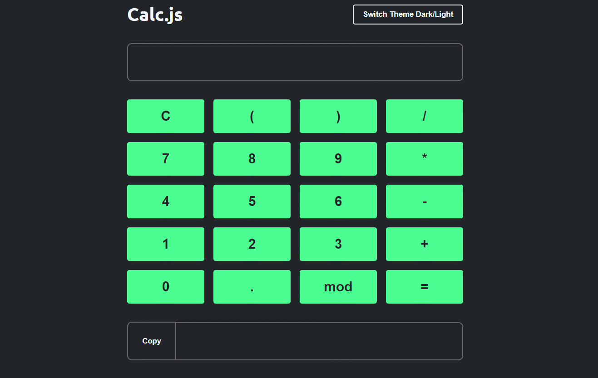

<h1 align="center">
  Calculadora
</h1>

## 💻 Detalhes do projeto

Aplicação desenvolvida no curso Programador Fullstack da OneBitCode. Consiste em uma calculadora simples que faz calculos da principais operações matematica, tem tema claro e escuro e é possível copiar o valor do resultado.

<h1 align="center">
    
</h1>

## :grey_question: Sobre essa aplicação

Criada no intuito de praticar os conhecimentos passados no curso sendo Html, Css e Javascript sem o uso de frameworks. 

## :rocket: Tecnologias utilizadas no projeto

As tecnologias utilizadas no projeto foram:

- [HTML5](https://developer.mozilla.org/en-US/docs/Web/Guide/HTML/HTML5)
- [CSS3](https://developer.mozilla.org/en-US/docs/Web/CSS)
- [JavaScript](https://developer.mozilla.org/en-US/docs/Web/JavaScript)

## :package: Como utilizar o projeto

É preciso ter instalado no computador o [Git](https://git-scm.com) e o [Node.js](https://nodejs.org/) para clonar e executar o projeto. O projeto pode ser baixado com as linhas de comando ou no formato zip clicando no botão "Code" na opção "Download ZIP"

```bash

    # Clonar o repositório
    $ git clone https://github.com/alexvieirasj/onebitcode_calculator.git

    # Entrar no diretório baixado
    $ cd onebitcode_calculator

    # Para executar a aplicação abra o arquivo calculadora.html no seu navegador
    
    # running on localhost
```

## :memo: Licença

Este projeto está sob a MIT License. Acesso o arquivo [LICENSE](https://github.com/alexvieirasj/onebitcode_calculator/blob/master/LICENSE) para maiores detalhes.
